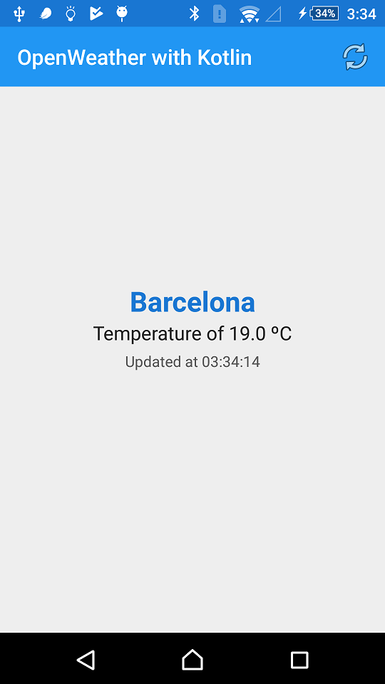

# OpenWeather with Kotlin

OpenWeather API use with Kotlin.

## Use Case

With this demo we will request to the [OpenWeatherMap](http://openweathermap.org/) service for the current temperature of Barcelona, Spain.

## Highlights

This demo uses:

+ `Kotlin 1.1.2-5`
+ `RxAndroid 2.0.1`
+ `Retrofit 2.3.0`
+ `Okhttp 3.5.0`
+ `Gson`
+ `ConstraintLayout 1.0.2`
+ `OpenWeather API 2.5`

## What do you need in order to make this work?

You will need to use your own OpenWeather ApiKey. Add it in your `gradle.properties`:

```
open_weather_api_key="YOUR KEY"
```

## Screenshots



## License

    Copyright 2017 Esteban Latre

    Licensed under the Apache License, Version 2.0 (the "License");
    you may not use this file except in compliance with the License.
    You may obtain a copy of the License at

        http://www.apache.org/licenses/LICENSE-2.0

    Unless required by applicable law or agreed to in writing, software
    distributed under the License is distributed on an "AS IS" BASIS,
    WITHOUT WARRANTIES OR CONDITIONS OF ANY KIND, either express or implied.
    See the License for the specific language governing permissions and
    limitations under the License.
